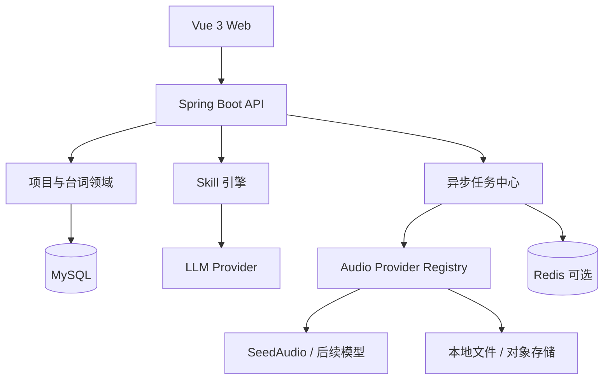

# 台词与音频自动化工作台后端开发文档 V1.0

> 项目代号：Audio Dialogue Studio  
> 后端技术：Java 21 + Spring Boot 3.x + MySQL 8  
> 文档版本：V1.0  
> 来源文档：[AudioDialogueStudio_Development_Document_V1.0.md](AudioDialogueStudio_Development_Document_V1.0.md)  
> 配套文档：[AudioDialogueStudio_Frontend_Development_Document_V1.0.md](AudioDialogueStudio_Frontend_Development_Document_V1.0.md)  
> 职责边界：本文描述服务端领域模型、API、数据库、AI/音频 Provider、异步任务、资产、导出、安全与部署；页面与交互实现见配套前端文档。

---

## 1. 产品定位与后端目标

系统服务于 1～2 分钟动漫图片剧情视频的音频生产。用户提供剧情背景和完整台词；服务端保存不可变原始输入，通过版本化 Skill 完成拆分与演绎分析，再为剪映 TTS 或外部语音模型提供可追溯的输出。

后端 V1 目标：

- 保存项目、背景、原始台词、分段、人工修改及分析快照；
- 将拆分与演绎规范抽象为可配置、可测试、可发布的 Skill；
- 通过 Provider SPI 解耦 LLM、SeedAudio 和未来模型；
- 提供幂等、可恢复、可取消、可重试的异步生成任务；
- 支持分段 WAV 标准化、插入静音、合并和快速重合并；
- 输出剪映 SRT、音频和不可变素材包；
- 提供统一 API、状态码、异常、安全、审计和可观测性；
- 采用模块化单体，同时保持未来拆分服务和新增图片模块的边界。

V1 不生成最终视频，不自动决定镜头或剧情，不建设复杂时间线、多人实时协作、完整权限平台，也不默认接入付费图片生成 API。

---

## 2. 核心业务模型与规则

### 2.1 输入与派生数据

`storyBackground` 与 `dialogueText` 必须是独立字段。背景只作为 AI 推理上下文，不进入最终字幕或音频；每次分析保存背景与原始台词快照。

原始台词永久保留，后续数据均为派生数据：

- `originalText`：与原始台词位置关联，只读；
- `spokenText`：送入 TTS，可保守调整标点和节奏；
- `subtitleText`：适合展示的字幕文本；
- 演绎参数：说话人、情绪、语气、语速、音量、停顿、重读及自然语言指令。

修改背景后仅标记相关分析可能过期，不覆盖已确认分段；修改 `spokenText` 后，将关联音频标为过期，但保留旧资产。重新分析不得静默覆盖人工编辑分段。

### 2.2 默认拆分规则

1. 按说话人变化强制拆分；
2. 单段只保留一个主要情绪和一个主要表达目的；
3. 情绪明显转折时拆分；
4. 长句按语义完整性拆分，不按固定字数机械切割；
5. 建议每段 8～45 个中文字符，超过 60 字必须拆分；
6. 太短且语义连续的片段合并，独立语气词除外；
7. 不切开固定短语、姓名或成语；
8. 省略号、破折号和重复词可表达停顿或犹豫；
9. 背景只用于理解，不得生成背景中不存在的新台词；
10. 无法判断时保持原句，不激进拆分；无法可靠识别角色时标记“未指定”。

### 2.3 默认润色规则

默认 `rewriteMode = STRICT`，另支持 `CONSERVATIVE` 和 `CREATIVE`。系统不得改变事实、人物关系和剧情含义，不删除人物特色表达，不擅自增加台词；可调整标点、重复、停顿和断句。语气说明写入 `voiceDirection`，实质词句改写必须保存 `rewriteLevel` 和 `rewriteReason`。

### 2.4 演绎输出

```json
{
  "emotion": {
    "primary": "annoyed",
    "secondary": "embarrassed",
    "intensity": 0.62
  },
  "tone": ["commanding", "restrained"],
  "speed": 0.95,
  "volume": 0.88,
  "pauseBeforeMs": 120,
  "pauseAfterMs": 380,
  "emphasis": ["让你过来"],
  "voiceDirection": "带有克制的不满和命令感，整体不要大喊。"
}
```

内部使用稳定英文枚举。Provider 不支持的参数由适配器降级为自然语言指令或忽略，并记录 warning。

---

## 3. 两条业务流程

### 3.1 公共分析流程

```text
创建/编辑项目
→ 选择已发布 Skill 版本
→ 创建分析任务并保存输入快照
→ LLM 返回结构化候选结果
→ JSON Schema 与业务规则校验
→ 用户预览、修改并确认
→ 应用为正式分段
```

分析失败不得污染正式数据。应用候选结果时必须检查项目版本和人工编辑冲突。

### 3.2 剪映 TTS

服务端按字幕文本估算初始时间轴并输出 UTF-8 `jianying_tts.srt`：

```text
duration = max(最短时长, 中文字符数 / 每秒字符数 + 标点停顿)
```

默认配置：中文语速 4.0 字/秒、段间间隔 200 ms、逗号 150 ms、句号/问号/感叹号 300 ms、单段最短 1.2 秒。单条字幕建议不超过两行，每行不超过 18 个中文字符；该限制默认作为警告，不擅自改写内容。

### 3.3 外部语音模型

```text
选择角色音色、Provider 与模型
→ 创建批量任务
→ 限流并发生成 segments/*.wav
→ 标准化、探测并登记资产
→ 失败项重试或单段重生成
→ 按顺序插入静音并合并 final.wav
```

正式字幕默认由剪映识别。服务端依据实际 WAV 时长生成 `timeline-map.json`，参考 SRT 不作为 V1 默认正式字幕。

---

## 4. 总体架构与技术栈

V1 采用“模块化单体 + 异步任务”。模块通过应用服务与领域事件解耦，未来可按 `ai-analysis`、`audio-generation` 和 `asset-export` 拆分。



推荐技术：

- Java 21 LTS、Spring Boot 3.x、Spring Web MVC、Validation、AOP；
- Spring Data JPA 或 MyBatis-Plus 二选一，项目内保持统一；
- MySQL 8 + Flyway；
- Redis 用于进度、限流、短期缓存和多实例锁，单机 V1 可关闭；
- Resilience4j 提供重试、限流、熔断和舱壁隔离；
- Spring Security 保留认证边界；
- SSE 推送任务进度；
- FFmpeg/ffprobe 负责音频探测、标准化、静音和合并；
- Micrometer + Actuator 提供指标与健康检查；
- OpenAPI 3 描述接口；
- Docker Compose 组合 API、MySQL、可选 Redis 和 Nginx。

---

## 5. 模块边界与代码组织

```text
com.example.audiodialogue
├── bootstrap
├── common
│   ├── api
│   ├── exception
│   ├── aop
│   ├── validation
│   ├── security
│   └── observability
├── project
├── dialogue
├── skill
├── ai
│   ├── llm
│   └── prompt
├── audio
│   ├── application
│   ├── domain
│   ├── provider
│   ├── processing
│   └── infrastructure
├── task
├── asset
├── export
└── future
    └── image
```

每个业务模块使用轻量分层：

```text
module/
├── api              # Controller、DTO
├── application      # 用例编排、事务入口
├── domain           # 实体、值对象、规则、端口
└── infrastructure   # 数据库、第三方 API、文件系统适配
```

Controller 不得直接操作 Repository；Provider 适配器不得承载项目业务规则；跨模块调用优先通过应用服务或明确事件；领域对象不得依赖 Web 或供应商 DTO。

---

## 6. Skill 与 AI 分析模块

### 6.1 Skill 模型

Skill 是可执行、可版本化的 AI 处理规范，包含任务类型、系统提示模板、输入/输出 JSON Schema、拆分规则、润色边界、情绪词表与映射、正反例、模型参数、版本状态和回归样例。

状态机：

```text
DRAFT → TESTING → PUBLISHED → ARCHIVED
```

发布前至少执行 JSON Schema、长句、多角色、情绪转折、原文不可篡改、相同输入稳定性抽检和 Provider 参数映射测试。发布版本不可原地修改；变更必须创建新版本。

### 6.2 分析执行

每次分析记录：

- `skillId + skillVersion`；
- LLM Provider 与模型；
- 背景和原始台词快照；
- 完整模板或 `promptHash`；
- 模型参数、开始/结束时间和状态；
- 原始结构化响应、校验 warning 与规范化结果。

分析输出先保存为候选结果。只有 `apply` 用例可在事务中写入正式分段。应用时验证项目版本、候选归属、运行状态和人工编辑冲突。

### 6.3 LLM Provider

LLM 接口与供应商实现分离，统一处理鉴权、超时、重试、响应解析、Schema 校验和日志脱敏。仅对超时、限流和 5xx 等可恢复错误重试；鉴权、参数、内容拒绝或 Schema 持续不合法不得盲目重试。

---

## 7. 音频 Provider 设计

### 7.1 核心接口

```java
public interface AudioGenerationProvider {
    String providerCode();

    ProviderCapabilities capabilities();

    AudioGenerationResult generate(AudioGenerationCommand command);

    default AudioGenerationResult query(String externalTaskId) {
        throw new UnsupportedOperationException("Async query is not supported");
    }
}
```

```java
public record AudioGenerationCommand(
        String requestId,
        String modelCode,
        String text,
        String voiceId,
        VoiceDirection direction,
        AudioFormat format,
        Map<String, Object> extensions
) {}
```

```java
@Component
public class AudioProviderRegistry {
    private final Map<String, AudioGenerationProvider> providers;

    public AudioProviderRegistry(List<AudioGenerationProvider> providerList) {
        this.providers = providerList.stream().collect(
                Collectors.toUnmodifiableMap(
                        AudioGenerationProvider::providerCode,
                        Function.identity()
                )
        );
    }

    public AudioGenerationProvider getRequired(String providerCode) {
        return Optional.ofNullable(providers.get(providerCode))
                .orElseThrow(() -> new ProviderNotFoundException(providerCode));
    }
}
```

采用 Strategy、Adapter、Registry/Factory、Template Method 和 Capability Model。新增模型优先增加 `ModelDescriptor` 配置；只有协议不同才新增 Provider。业务服务不得堆叠 `if (model == ...)`。

### 7.2 能力与配置

```yaml
audio:
  providers:
    seed-audio:
      enabled: true
      base-url: ${SEED_AUDIO_BASE_URL}
      api-key: ${SEED_AUDIO_API_KEY}
      timeout-seconds: 120
      max-concurrency: 4
      models:
        - code: seed-audio-default
          display-name: SeedAudio Default
          supports-emotion: true
          supports-reference-audio: true
          supports-async-task: false
```

能力模型至少声明情绪、参考音频、同步/异步、流式结果、音频格式和参数范围。API Key 不得写入 Git 或普通业务表；优先环境变量或密钥服务，若由界面维护则加密保存且 API 只返回脱敏值。

---

## 8. 异步任务与并发控制

HTTP 请求只创建任务，不等待全部音频完成。

批量任务状态：

```text
PENDING → RUNNING → SUCCEEDED
                  ↘ PARTIAL_SUCCESS
                  ↘ FAILED
         ↘ CANCEL_REQUESTED → CANCELLED
```

单段状态：

```text
WAITING → GENERATING → SUCCESS
                     ↘ RETRY_WAIT → GENERATING
                     ↘ FAILED
```

关键要求：

- 使用 `projectId + segmentId + version + modelCode + parametersHash` 生成幂等键；
- 若供应商支持幂等键，则同步传递；
- 分别限制全局、Provider、项目和用户并发；
- 指数退避加入随机抖动；
- 仅对超时、限流、网络异常和 5xx 自动重试；
- 参数错误、内容拒绝和鉴权错误直接失败；
- 单段失败不回滚已成功音频，任务可进入 `PARTIAL_SUCCESS`；
- 服务重启后根据数据库状态恢复或补偿；
- 取消是协作式取消，不能保证撤销已提交的第三方任务；
- SSE 仅通知进度，数据库查询是最终事实源。

单实例可使用受控线程池或 Java 21 虚拟线程。多实例必须通过 Redis 锁、数据库抢占或消息队列避免重复消费，并用租约/心跳处理执行节点失联。

SSE 事件应包含 `eventId`、`taskId`、`itemId`、状态、进度、时间和必要的错误摘要；支持 `Last-Event-ID` 或连接后先查询快照。

---

## 9. 音频处理与资产管理

所有 Provider 输出先标准化后登记和合并：

- WAV、PCM 16-bit；
- 采样率统一为 44.1 kHz 或项目配置值；
- 声道统一为 mono 或 stereo；
- 使用 ffprobe 记录时长、采样率、声道、响度、峰值和文件哈希；
- 按 `pauseAfterMs` 插入静音；
- 合并在临时文件中完成，校验成功后原子替换 `final.wav`；
- 单段重生成只重新标准化该段并重合并，不重跑其他片段；
- 合并资产保存所用分段资产 ID、版本、顺序及参数清单。

开发环境可使用本地目录；生产环境通过 `ObjectStorageProvider` 切换到 S3 兼容存储。业务层只持有资产 ID/对象键，不依赖某实例绝对路径。

旧资产不立即删除。用户修改文本或参数后，旧音频标记过期；物理清理由延时任务根据保留策略执行。

---

## 10. 导出模块

导出是异步、不可变快照。完整素材包结构：

```text
project-name/
├── source/
│   ├── story-background.txt
│   └── dialogue-original.txt
├── audio/
│   ├── final.wav
│   └── segments/
│       ├── 001.wav
│       ├── 002.wav
│       └── 003.wav
├── subtitle/
│   └── jianying_tts.srt
├── metadata/
│   ├── dialogue.json
│   ├── generation-manifest.json
│   └── timeline-map.json
└── README.txt
```

导出记录绑定项目、分段版本、音频资产清单、配置和创建人。生成 ZIP 时禁止使用用户输入直接构造路径，文件名需规范化并防止 Zip Slip。下载通过授权接口或短时签名地址。

---

## 11. 数据库设计

### 11.1 核心表

| 表名 | 用途 |
| --- | --- |
| `ads_project` | 台词工程、背景和原始台词 |
| `ads_character` | 项目角色、默认音色与人物说明 |
| `ads_dialogue_segment` | 正式分段、字幕与演绎参数 |
| `ads_analysis_run` | AI 分析输入快照、模型和 Skill 版本 |
| `ads_skill` | Skill 元数据 |
| `ads_skill_version` | 模板、规则、Schema 与版本状态 |
| `ads_provider` | Provider 基本配置，不存明文密钥 |
| `ads_model` | Provider 下的模型及能力声明 |
| `ads_generation_task` | 批量生成任务 |
| `ads_generation_item` | 分段生成子任务 |
| `ads_audio_asset` | 分段或合并音频资产 |
| `ads_export_record` | 导出快照和包记录 |
| `ads_audit_log` | 配置与关键操作审计 |

### 11.2 关键字段

`ads_project`：

```text
id, project_no, name, story_background, original_dialogue,
output_mode, default_skill_version_id, status,
version, created_by, created_at, updated_by, updated_at, deleted
```

`ads_dialogue_segment`：

```text
id, project_id, segment_no, speaker_id, semantic_group,
source_start, source_end, original_text, spoken_text, subtitle_text,
emotion_json, voice_direction, pause_before_ms, pause_after_ms,
manual_edited, analysis_run_id, version, created_at, updated_at
```

`source_start/source_end` 关联原始文本位置。扩展演绎参数可放在 `emotion_json`，常用查询字段必须单独建列。

`ads_generation_item`：

```text
id, task_id, segment_id, segment_version, provider_code, model_code,
voice_id, request_hash, status, attempt_count, external_task_id,
error_code, error_message, started_at, finished_at, audio_asset_id
```

主要表包含乐观锁 `version`、审计时间和逻辑删除标记；状态使用字符串枚举。至少为项目状态、分段顺序、任务状态、请求哈希、资产归属和更新时间建立必要索引与唯一约束。

### 11.3 一致性原则

- 音频资产与 `segmentVersion` 绑定；
- 修改 `spokenText` 后旧音频保留但标记过期；
- 合并音频保存其分段资产清单和顺序；
- 重分析不覆盖人工编辑分段；
- 项目删除先进入回收站，物理清理由定时任务延迟执行；
- 导出包是某一时刻的不可变快照；
- 数据库事务只覆盖本地状态，第三方调用和文件写入通过状态机、Outbox/补偿或等价机制保证最终一致性。

---

## 12. API 设计

API 前缀：`/api/v1`。所有写接口接受 `Idempotency-Key`；更新接口使用版本号或 `If-Match`。

### 12.1 项目与分析

| 方法 | 路径 | 说明 |
| --- | --- | --- |
| `POST` | `/projects` | 创建项目 |
| `GET` | `/projects/{id}` | 获取项目详情 |
| `PUT` | `/projects/{id}` | 修改背景与台词 |
| `POST` | `/projects/{id}/analysis-runs` | 创建分析任务 |
| `GET` | `/projects/{id}/analysis-runs/{runId}` | 查询分析状态和候选结果 |
| `POST` | `/projects/{id}/analysis-runs/{runId}/apply` | 确认并应用结果 |

### 12.2 台词分段

| 方法 | 路径 | 说明 |
| --- | --- | --- |
| `GET` | `/projects/{id}/segments` | 获取分段列表 |
| `PUT` | `/segments/{segmentId}` | 编辑文本和演绎信息 |
| `POST` | `/segments/{segmentId}/split` | 人工拆分 |
| `POST` | `/segments/merge` | 合并连续分段 |
| `POST` | `/projects/{id}/segments/reorder` | 调整顺序 |

### 12.3 音频生成

| 方法 | 路径 | 说明 |
| --- | --- | --- |
| `GET` | `/audio/providers` | 查询 Provider、模型与能力 |
| `POST` | `/projects/{id}/audio-tasks` | 批量创建任务 |
| `GET` | `/audio-tasks/{taskId}` | 查询任务快照 |
| `GET` | `/audio-tasks/{taskId}/events` | SSE 进度流 |
| `POST` | `/audio-items/{itemId}/retry` | 重试失败分段 |
| `POST` | `/segments/{segmentId}/regenerate` | 单段重生成 |
| `POST` | `/projects/{id}/audio/merge` | 重新合并 `final.wav` |
| `POST` | `/audio-tasks/{taskId}/cancel` | 请求取消任务 |

### 12.4 Skill 与导出

| 方法 | 路径 | 说明 |
| --- | --- | --- |
| `GET` | `/skills` | Skill 列表 |
| `GET` | `/skills/{id}/versions` | 版本列表 |
| `POST` | `/skills/{id}/versions` | 创建草稿版本 |
| `POST` | `/skill-versions/{id}/test` | 运行测试样例 |
| `POST` | `/skill-versions/{id}/publish` | 发布版本 |
| `POST` | `/projects/{id}/exports/srt` | 导出剪映 TTS SRT |
| `POST` | `/projects/{id}/exports/package` | 导出完整素材包 |
| `GET` | `/exports/{exportId}` | 查询并下载导出结果 |

OpenAPI 必须描述 DTO、枚举、分页、错误和 SSE 事件。Controller 只负责鉴权、校验、DTO 转换和调用应用服务。

---

## 13. 统一响应、异常与 AOP

成功响应：

```json
{
  "success": true,
  "code": "OK",
  "message": "success",
  "data": {},
  "traceId": "01J...",
  "timestamp": "2026-09-20T14:00:00Z"
}
```

错误响应：

```json
{
  "success": false,
  "code": "AUDIO_PROVIDER_RATE_LIMITED",
  "message": "语音服务请求过于频繁，请稍后重试",
  "data": null,
  "traceId": "01J...",
  "timestamp": "2026-09-20T14:00:00Z"
}
```

业务码分域：`COMMON_*`、`AUTH_*`、`PROJECT_*`、`DIALOGUE_*`、`SKILL_*`、`AUDIO_*`、`PROVIDER_*`、`EXPORT_*`。

使用 `@RestControllerAdvice` 将校验、业务、鉴权、并发冲突、供应商和未知异常映射为明确 HTTP 状态码与业务码。AOP 用于日志、耗时、幂等、审计和脱敏，不得吞掉业务异常。未知异常对外返回通用文案，对内通过 `traceId` 关联完整日志。

---

## 14. 安全设计

- 使用 Spring Security 保留认证与授权边界；
- API Key 通过环境变量或密钥管理服务保存，界面维护时加密落库且只返回脱敏值；
- 参考音频限制格式、MIME、大小和时长，并以文件签名检测真实类型；
- 文件名和路径由服务端生成，防止路径穿越与 Zip Slip；
- 下载使用鉴权接口或短时签名 URL；
- 日志/审计脱敏 Token、Cookie、Authorization、密钥和音色隐私信息；
- Provider 原始请求按项目配置决定是否留存，并设置保留期限；
- 接口实施速率限制、用户配额和任务并发上限；
- 生产环境强制 HTTPS；
- 导出、删除、Skill 发布、Provider 变更等关键操作写审计日志；
- 声音克隆预留授权确认、来源、使用范围和操作者字段。

---

## 15. 高可用、可观测性与运维

- API 服务无状态，资产不绑定某个实例本地路径；
- MySQL 定期备份，按规模采用主从或云高可用；
- 外部调用分别配置连接、读取和总超时；
- Provider 级限流、熔断和舱壁隔离，防止单个模型拖垮系统；
- 任务状态与资产登记通过事务和补偿保证一致性；
- 健康检查分为存活、就绪和依赖检查；
- 日志统一 JSON 格式，贯穿 `traceId/projectId/taskId/segmentId`；
- 指标至少包括请求/任务成功率、P95、重试次数、失败原因、队列长度、并发数、供应商限流次数、生成音频分钟数和存储容量；
- 告警覆盖任务堆积、Provider 大面积失败、数据库连接耗尽、磁盘/对象存储异常及导出失败；
- 禁止指标标签使用台词正文或其他高基数字段。

部署形态：Nginx + Spring Boot API + MySQL + 可选 Redis。开发环境音频可存本地；生产环境推荐 S3 兼容对象存储。Flyway 在部署阶段执行，失败时阻止不兼容版本启动。

---

## 16. 测试策略

### 16.1 业务与集成测试

- 单元测试：拆分规则校验、SRT 时间估算、状态机、参数映射和能力降级；
- 集成测试：事务、乐观锁、幂等、任务恢复、资产登记和导出快照；
- Provider 契约测试：统一 Command 到供应商参数/错误的映射；
- Mock Server：限流、超时、5xx、异步查询、非法响应和内容拒绝；
- 音频快照测试：格式、采样率、声道、时长、静音和拼接顺序；
- 并发测试：重复请求、单段重生成、多项目并发、取消和服务重启；
- 安全测试：越权下载、路径穿越、Zip Slip、密钥泄露和恶意文件名。

### 16.2 Skill 固定评测集

- 单角色长独白；
- 多角色交替；
- 冷淡、愤怒、尴尬、缓和等情绪转折；
- 省略号、重复、反问与讽刺；
- 背景可能误导模型的反例；
- 原文不可改动的严格模式；
- JSON 缺字段、非法枚举和越界数值。

每个 Skill 新版本发布前生成差异报告，失败用例阻止发布或要求显式审批。

---

## 17. 后端开发阶段

### 阶段一：工程基础

- 初始化 Spring Boot、MySQL、Flyway；
- 建立统一响应、异常、日志、状态码、安全边界；
- 完成项目 CRUD、剧情背景和原始台词保存。

### 阶段二：Skill 与台词领域

- 建立 Skill/版本/测试模型并内置默认规则；
- 接入一个 LLM Provider；
- 完成分析任务、候选结果、应用冲突检查；
- 完成分段编辑、拆分、合并、排序及 SRT 导出。

### 阶段三：语音生成

- 实现 `AudioGenerationProvider` SPI 和第一个 SeedAudio 适配器；
- 完成队列、并发、重试、取消、恢复和 SSE；
- 完成分段资产、FFmpeg 标准化、静音与合并。

### 阶段四：导出与稳定性

- 完成素材目录与 ZIP 导出；
- 增加幂等、熔断、限流、多实例任务保护；
- 增加指标、审计、健康检查、备份和 Docker Compose；
- 完成端到端、性能、安全和异常场景测试。

### 阶段五：扩展验证

- 接入第二个音频模型验证 Provider 解耦；
- 抽取通用资产与任务能力；
- 评估人物库、镜头卡和图片 Provider，不影响 V1 发布。

---

## 18. 后端 V1 验收标准

1. 项目可分别保存剧情背景与不可变原始台词；
2. 已发布 Skill 可创建分析运行并保存输入、模型、版本和 Prompt 哈希；
3. AI 输出经 Schema 与规则校验，失败不污染正式数据；
4. 分析结果经确认后才能应用，人工编辑不被重分析静默覆盖；
5. 分段支持编辑、拆分、合并、排序和乐观锁；
6. 可生成结构正确、UTF-8、可导入的剪映 SRT；
7. 外部模型路线可并发生成 WAV，支持限流、重试、取消、恢复和单段重生成；
8. 分段修改后相关音频标记过期，旧资产仍可追溯；
9. 可按顺序、停顿和统一参数原子生成 `final.wav`；
10. SSE 断开不影响任务，查询 API 始终返回真实状态；
11. 接入第二模型无需修改项目、台词和任务核心逻辑；
12. 所有接口使用统一响应、业务码、异常和幂等/并发控制；
13. 导出包包含原始输入、分段音频、合并音频与元数据清单；
14. API Key、隐私和鉴权头不出现在日志或前端响应；
15. 核心状态机、Provider、音频和安全场景通过自动化测试；
16. 服务重启后任务可恢复或进入可解释的补偿状态。

---

## 19. 后续扩展边界

图片能力以独立上下文加入：

```text
future/image
├── character
├── shot
├── prompt-skill
├── provider
├── generation
└── asset
```

可复用项目与人物、Skill 引擎、Provider Registry、任务中心、资产版本、SSE、导出和审计。Provider SPI 可扩展为：

```text
Provider SPI
├── LlmProvider
├── AudioGenerationProvider
├── ImageGenerationProvider
├── SpeechRecognitionProvider
└── ObjectStorageProvider
```

不同媒介必须保留各自的 Command、Result 和 Capability，不设计字段混乱的万能 Provider 接口。

---

## 20. 待确认实现决策

开始编码前确认：

1. LLM 分析服务及其结构化输出能力；
2. 第一个 SeedAudio 接口的请求协议、鉴权及同步/异步形式；
3. Spring Data JPA 与 MyBatis-Plus 的选择；
4. V1 是否需要多用户登录；
5. 首版音频资产使用本地存储还是对象存储；
6. Redis 是否在首版启用，以及单实例/多实例部署目标；
7. 剪映实际导入 SRT 后文本朗读是否满足预期。

这些决策影响适配器和部署配置，但不改变核心模块边界。

---

## 附录 A：分析结果示例

```json
{
  "projectId": "P202609200001",
  "skill": {
    "code": "dialogue-performance-zh",
    "version": "1.0.0"
  },
  "backgroundSnapshot": "女主是男主所在医院的科室主任……",
  "segments": [
    {
      "segmentNo": 1,
      "speaker": "女主",
      "originalText": "过来，我说让你过来。",
      "spokenText": "过来。……我说，让你过来。",
      "subtitleText": "过来，我说让你过来。",
      "semanticGroup": "命令与施压",
      "emotion": {
        "primary": "annoyed",
        "secondary": "embarrassed",
        "intensity": 0.62
      },
      "tone": ["commanding", "restrained"],
      "speed": 0.95,
      "volume": 0.88,
      "pauseBeforeMs": 0,
      "pauseAfterMs": 350,
      "emphasis": ["让你过来"],
      "voiceDirection": "克制但具有命令感，不要大喊，第二句稍慢并加重。",
      "rewriteMode": "STRICT",
      "rewriteReason": "仅调整标点和停顿"
    }
  ]
}
```
